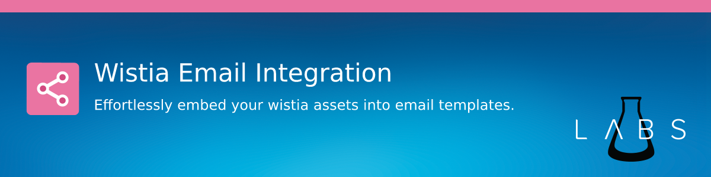

# Introduction

## Features

- Embed Wistia Videos in Lightning Emails without leaving the Builder
- Track video clicks with Wistia
- Customize the Thumbnail dimensions without writing any code
- Customize the Play Button to match your brand

## Contact & Support

- Create a [GitHub issue](https://github.com/shrej/wistia-video/issues) for bug reports, feature requests, or questions
- Add a ⭐️ [star on GitHub](https://github.com/shrej/wistia-video) or ❤️ [tweet](https://twitter.com/intent/tweet?url=https%3A%2F%2Fgithub.com%2Fshrej%2Femail-video&hashtags=salesforcelabs,pardot) to support the project!

<!-- GitHub Buttons -->

