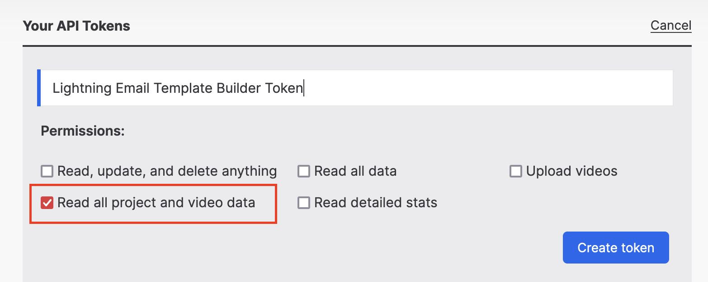
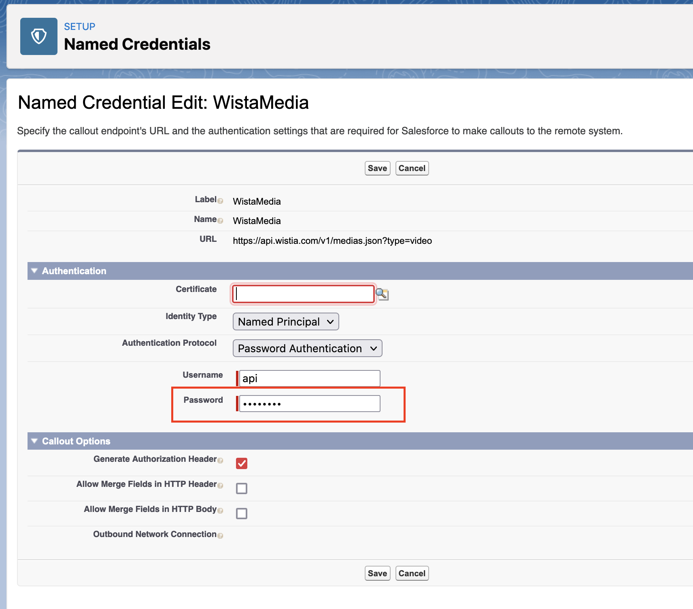

# Getting Started with Wistia Email Integration

This component connects your Wistia Account with the new Lightning Email Builder. It allows you to embed and track wistia videos in email without writing any code.

## Prerequisites

1. **A Wistia Account**

1. **The Appexchange Package** 
   Though you can install this component directly in a production org, we recommend installing it in a sandbox first.

   [Get it now](https://appexchange.salesforce.com/)

1. **Drag and Drop Builder Permissions** 
   If you do not see the "Edit in builder" option on a Lightning Email Template, please follow the instructions [here.](https://help.salesforce.com/articleView?id=email_template_builder_create.htm&type=0)

## Usage

You can perform the setup in 4 easy steps:

1. **Get a Wistia API Key**: Creating a Wistia API key is really straightforward. We strongly recommend creating a brand new key with only 'Read all project and video data'. Copy the newly generated token. We will use it to authenticate to Wistia. Please see the official documentation from Wistia for more information [here.](https://wistia.com/support/developers/data-api#creating-and-managing-access-tokens)
   

1. Go to Salesforce Setup and search for 'Named Credentials'.

1. Find a Named Credential named - 'WistiaMedia' and click 'Edit'.

1. Finally, paste the api token that you obtained in Step 1 into the password field as in the screenshot below.
   
1. That's it! You are done 🎉

## Contact & Support

- Create a [GitHub issue](https://github.com/shrej/wistia-video/issues) for bug reports, feature requests, or questions
- Add a ⭐️ [star on GitHub](https://github.com/shrej/wistia-video) or ❤️ [tweet](https://twitter.com/intent/tweet?url=https%3A%2F%2Fgithub.com%2Fshrej%2Femail-video&hashtags=salesforcelabs,pardot) to support the project!

<!-- GitHub Buttons -->

